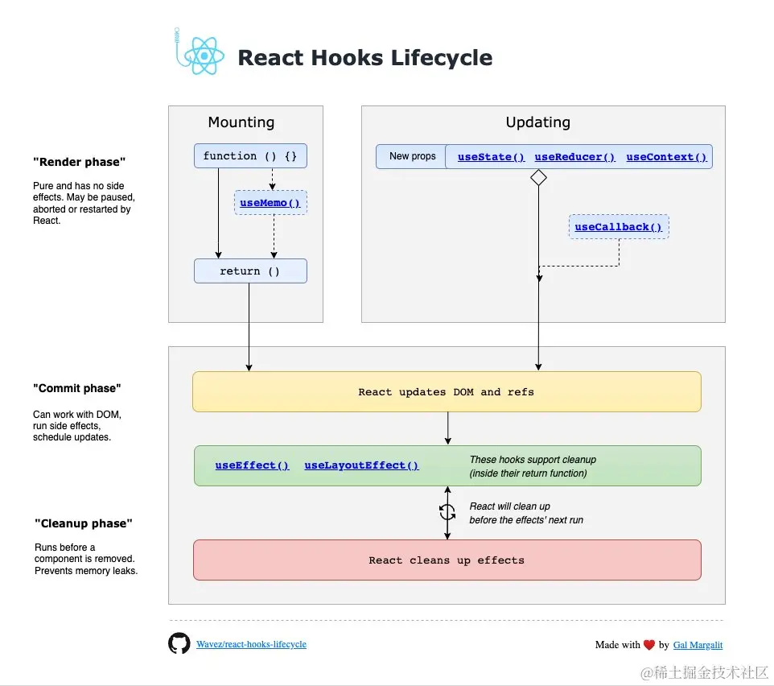

## 什么是 Virtual DOM?

## React 组件之间如何通信？

- 父组件通过 props 向子组件传递状态
- 子组件通过回调方法更新父组件的状态
- 兄弟组件通过状态提升到最近的共同父组件或者状态管理工具通信

## 详解 React Hooks 的生命周期

## React 的重渲染

1. 组件的 state 变化
2. 父组件重渲染导致子组件也重渲染
3. 组件接收到新的 props
4. context 变化导致所有消费组件重渲染

## 为什么 React 渲染列表时需要加上 key？

在 React 渲染列表时，需要为每个列表项添加 key，其主要原因是 提升性能并减少不必要的 DOM 操作

## 如何理解 Fiber 架构

## Redux 的原理&React-Redux 的原理

Redux 的原理是发布订阅模式，React-Redux 的原理是 React.Context+useContext

## vue2 与 vue3 的双向绑定原理
