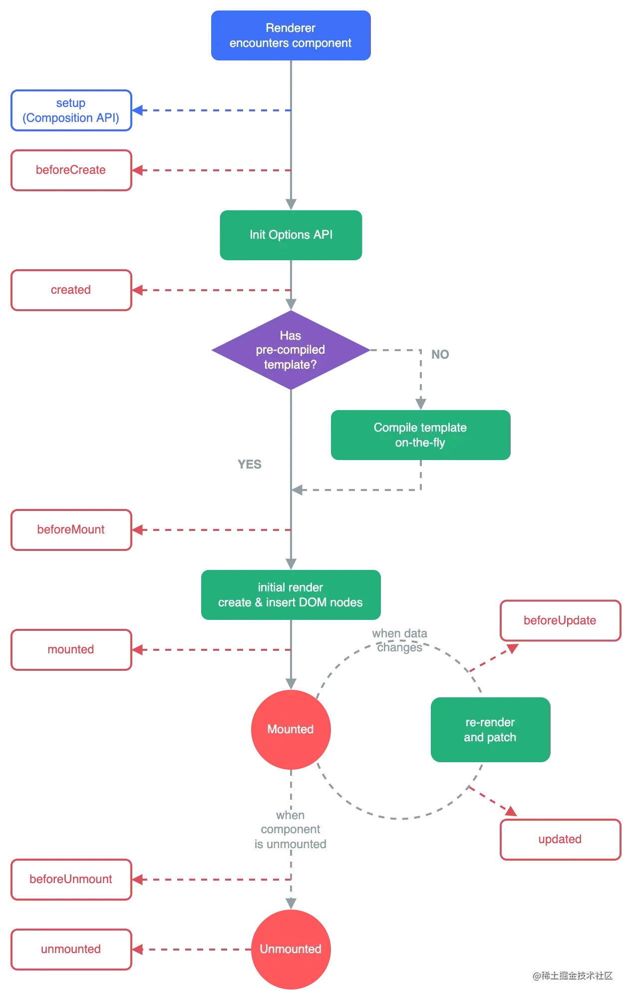

## 什么是 Virtual DOM?

Virtual DOM 是对实际 DOM 的一种轻量级抽象。它是一个 JavaScript 对象，表示了 DOM 的结构和状态。虚拟 DOM 本质上是页面 UI 的一个内存表示，它与实际 DOM 对应，但它并不会直接操作页面中的 DOM 元素，在更新 UI 时，不直接操作浏览器中的 DOM，而是先通过虚拟 DOM 更新 UI，最后再根据虚拟 DOM 和实际 DOM 的差异进行高效的更新，最后利用操作 DOM 的方法更新 DOM

## React 组件之间如何通信？

- 父组件通过 props 向子组件传递状态
- 子组件通过回调方法更新父组件的状态
- 兄弟组件通过状态提升到最近的共同父组件或者状态管理工具通信

## 详解 React Hooks 的生命周期

## React 的重渲染

1. 组件的 state 变化
2. 父组件重渲染导致子组件也重渲染
3. 组件接收到新的 props
4. context 变化导致所有消费组件重渲染

## 为什么 React 渲染列表时需要加上 key？

在 React 渲染列表时，需要为每个列表项添加 key，其主要原因是 提升性能并减少不必要的 DOM 操作

## 如何理解 Fiber 架构

## Redux 的原理&React-Redux 的原理

Redux 的原理是发布订阅模式，React-Redux 的原理是 React.Context+useContext

## vue2 与 vue3 的双向绑定原理

### vue2 的双向绑定原理

Vue2 的双向绑定主要是通过 Object.defineProperty 实现的，它利用了 JavaScript 的 getter 和 setter 来监听数据的变化，并通过更新视图来实现双向绑定。

- 数据劫持： Vue2 在创建 Vue 实例时，会遍历 data 对象中的每个属性，并使用 Object.defineProperty() 将这些属性转换为 getter 和 setter。当属性值发生变化时，setter 会被触发，进而通知视图更新。

- 视图更新： 当数据发生变化时，setter 会将视图组件中的依赖（即需要该数据的视图）收集到一个依赖管理器中。视图更新时，Vue2 会通过通知这些依赖进行重新渲染。

### vue3 的双向绑定原理

Vue3 相比 Vue2 在双向绑定的实现上进行了优化，核心的变化是使用了 Proxy 来取代 Object.defineProperty，使得 Vue3 在性能、灵活性等方面有了显著提升。

- 数据劫持： Vue3 使用 Proxy 对整个数据对象进行代理。与 Object.defineProperty 不同，Proxy 可以拦截对象的所有操作（包括属性访问、修改、删除等），并通过 getter 和 setter 实现对数据变化的监听。

- 视图更新： Vue3 的响应式系统通过 依赖收集 和 依赖触发 来更新视图。当访问数据时，Proxy 会触发 get 方法，收集依赖；当数据修改时，set 方法会被触发，从而通知依赖进行更新。

## Vue3 的生命周期

## Vue3.0 有什么更新
